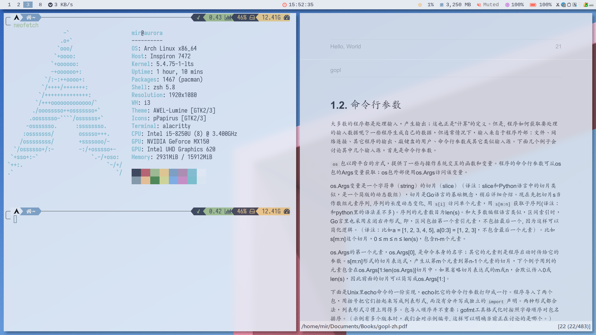

# Table of Contents

1.  [效果](#org7b39cbc)
2.  [怎么用我的配置](#org706666b)
3.  [依赖](#orgbe431b3)
4.  [配置解读](#org3fb4ea4)

# 效果

# 怎么用我的配置

1.  先把这个仓库克隆到本地
2.  如果你之前有自己的配置记得先备份

    cp -vr alacritty kitty i3 picom dunst rofi zathura ~/.config

# 依赖

-   终端：alacritty, kitty(可选)
-   护眼：redshift-gtk
-   程序启动器：rofi
-   壁纸设置器：nitrogen, feh
-   特效合成器：picom-ibhagwan-git
-   文件管理器：thunar
-   电源管理器：xfce4-power-manager
-   截图工具：flameshot, scrot
-   输入法：fcitx5
-   科学上网工具：qv2ray
-   剪切板管理器：copyq
-   云同步工具：nutstore
-   状态 bar：polybar
-   通知管理器：dunst
-   锁屏管理器：betterlockscreen, xautolock
-   pdf 阅读器：zathura
-   文本编辑器：nvim, doom emacs(可选)
-   屏幕亮度调节器：light

# 配置解读

从前到后

-   Windows 键为 mod 键
-   Alt 键为 mod1 键
-   i3 相关的字体使用 Input Nerd Font，字号为 9
-   窗口 title 相关设置
-   窗口 title 的主题颜色
-   窗口边框和窗口间距设置
-   自动启动 xautolock(用于自动锁屏)，避免锁屏可以将鼠标移动到屏幕四个角之一
-   交换左 ctrl 和 CapsLock 键
-   i3 启动时自动启动的软件
-   控制音频相关
-   控制屏幕亮度相关
-   固定特定 WM_CLASS 的窗口出现的工作区
-   特定 WM_CLASS的窗口出现时悬浮
    
    如果想要自己添加新的窗口，执行：
    
        xprop | grep WM_CLASS
    
    之后鼠标点击你想要看的窗口就可以看到这个窗口的 WM_CLASS
-   mod+return 打开 alacritty，mod+shift+return 打开 kitty
-   使用脚本切换亮暗主题

    有关亮暗主题的详细信息可以访问这个仓库：[Nord-and-Light](https://github.com/MiraculousMoon/nord-and-light)
-   mod1(Alt)+p 重启 polybar
-   定义启动不同应用的快捷键
-   定义截图的不同方式
-   启动不同的 IDE 的模式
-   调节 redshift 不同的护眼模式
-   mod+q 关闭窗口
-   mod+d 启动 rofi 启动应用的模式，mod+Tab 启动 rofi 执行命令的模式
-   键盘快捷键控制鼠标聚焦窗口，移动窗口的相对位置
-   mod+分号竖直切割窗口
-   mod+v 水平切割窗口
-   mod+shift+q 切换切割方式
-   mod+f 切换当前聚焦窗口的全屏模式
-   切换容器的展示方式(窗口的显示模式)
-   mod+shift+sapce 切换当前聚焦窗口漂浮或者平铺
-   mod+a 聚焦到父容器
-   定义 8 个工作区，mod+1/2/3&#x2026;切换工作区，mod+shift+1/2/3&#x2026;移动窗口到目标工作区
-   mod+shift+c 重载配置，mod+shift+r 重启 i3，mod+shift+escape 退出 i3
-   mod+r 进入调节窗口大小的模式

