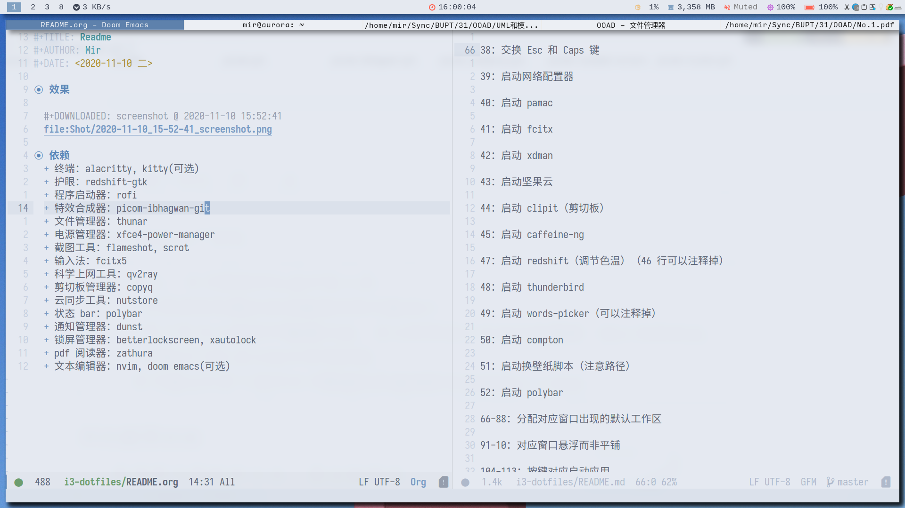

# Table of Contents

1.  [效果](#org4f2d749)
2.  [依赖](#orgc07a8ab)
3.  [配置解读](#orgd0380ef)

# 效果

# 依赖

-   终端：alacritty, kitty(可选)
-   护眼：redshift-gtk
-   程序启动器：rofi
-   特效合成器：picom-ibhagwan-git
-   文件管理器：thunar
-   电源管理器：xfce4-power-manager
-   截图工具：flameshot, scrot
-   输入法：fcitx5
-   科学上网工具：qv2ray
-   剪切板管理器：copyq
-   云同步工具：nutstore
-   状态 bar：polybar
-   通知管理器：dunst
-   锁屏管理器：betterlockscreen, xautolock
-   pdf 阅读器：zathura
-   文本编辑器：nvim, doom emacs(可选)

# 配置解读

-   Line12: 
    Windows 键为 mod 键
-   Line13: 
    Alt 键为 mod1 键
-   Line17: 
    i3 相关的字体使用 Input Nerd Font，字号为 9
-   Line16-29: 
    窗口 title 相关设置
-   Line31-36: 
    窗口 title 的主题颜色
-   Line38-42: 
    窗口边框和窗口间距设置
-   Line46: 
    自动启动 xautolock(用于自动锁屏)，避免锁屏可以将鼠标移动到屏幕四个角之一
-   Line50: 
    交换左 ctrl 和 CapsLock 键
-   Line51-60: 
    i3 启动时自动启动的软件
-   Line64-68: 
    控制音频相关
-   Line73-96: 
    固定特定 WM_CLASS 的窗口出现的工作区
-   Line98-108: 
    特定 WM_CLASS 的窗口出现时悬浮
-   Line110-123: 
    定义启动不同应用的快捷键
-   Line125-139: 
    启动不同的 IDE 的模式
-   Line141-156: 
    调节 redshift 不同的护眼模式
-   Line160: 
    mod+q 关闭窗口
-   Line163-164: 
    mod+d 启动 rofi 启动应用的模式，mod+Tab 启动 rofi 执行命令的模式
-   Line170-192: 
    键盘快捷键控制鼠标聚焦窗口，移动窗口的相对位置
-   Line195: 
    mod+分号竖直切割窗口
-   Line197: 
    mod+v 水平切割窗口
-   Line199: 
    mod+shift+q 切换切割方式
-   Line202: 
    mod+f 切换当前聚焦窗口的全屏模式
-   Line205-207: 
    切换容器的展示方式(窗口的显示模式)
-   Line213: 
    mod+shift+sapce 切换当前聚焦窗口漂浮或者平铺
-   Line216: 
    mod+a 聚焦到父容器
-   Line223-250: 
    定义 8 个工作区，mod+1/2/3&#x2026;切换工作区，mod+shift+1/2/3&#x2026;移动窗口到目标工作区
-   Line252-257: 
    mod+shift+c 重载配置，mod+shift+r 重启 i3，mod+shift+escape 退出 i3
-   Line260-284: 
    mod+r 进入调节窗口大小的模式

